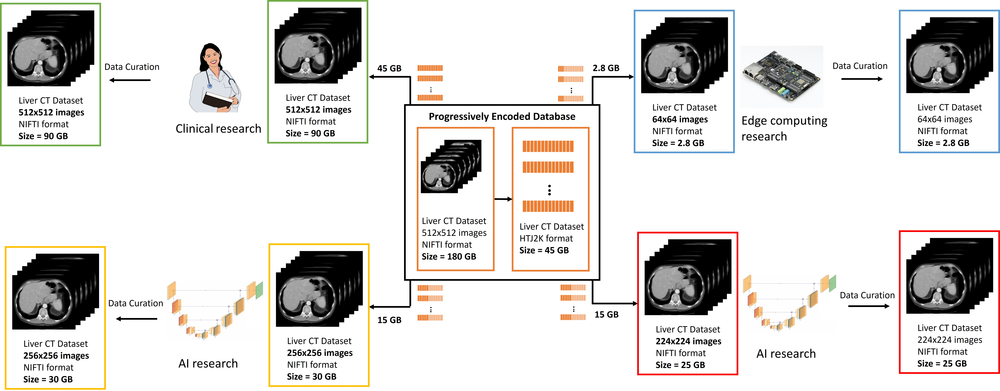

# Medical Image Streaming Toolkit (MIST)

<<<<<<< HEAD
**Note:** This repository is currently a work in progress. Please contact us for more details [here](mailto:pkulkarni@som.umaryland.edu,vparekh@som.umaryland.edu).

### Announcements

- **[17 July 2023]** - OpenJPHpy our toolkit for encoding and/or decoding High-Throughput JPEG 2000 (HTJ2K) images directly through Python is now available [here](https://github.com/UM2ii/openjphpy).
- **[1 July 2023]** - Our preprint on MIST is available on arXiv [here](https://arxiv.org/pdf/2307.00438.pdf).

## About

The Medical Image Streaming Toolkit (MIST), an open-source framework that operationalizes progressive resolution for medical imaging data by progressively encoding and streaming medical imaging datasets. MIST is built on the scientific premise that progressive resolution can:
- Dramatically reduce medical image data infrastructure costs by reducing storage and data transfer bandwidth requirements
- Improve image data useability by making it more practical for users to download this data, even with low storage or slow internet connections. 

In our [preprint](https://arxiv.org/pdf/2307.00438.pdf), we demonstrate that MIST can dramatically reduce medical image data infrastructure requirements for hosting and streaming datasets while maintaining diagnostic image quality and information for deep learning analyses and applications.

=======
This repository provides an open-source implementation of MIST. Source code to recreate the experimental design from our paper is available [here](https://github.com/UM2ii/MIST_Paper).

**Note:** This repository is currently a work in progress. Please contact us for more details [here](mailto:pkulkarni@som.umaryland.edu,vparekh@som.umaryland.edu).
>>>>>>> 08902edf52a4f4fd82981ec0b1c13d1343c26f6d
