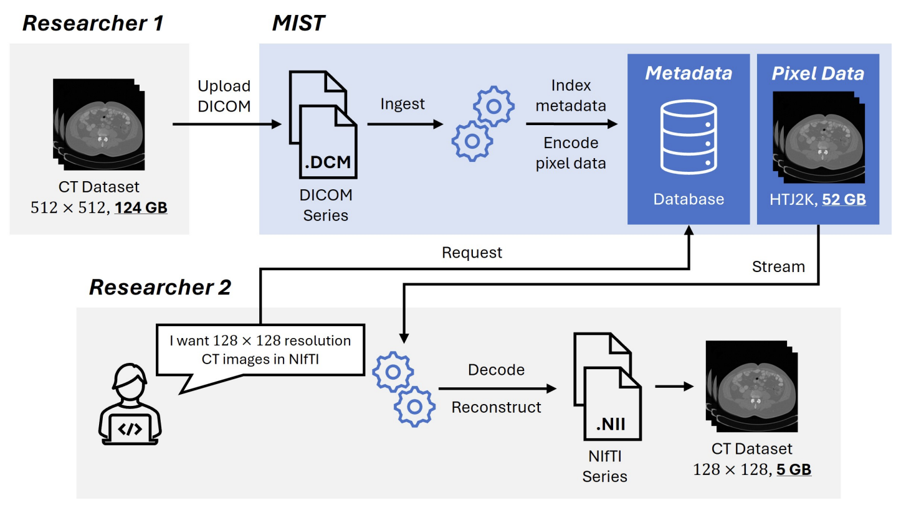

**Note:** This repository is currently work in progress.
___

 

# Towards Resource-Efficient Streaming of Large-Scale Medical Image Datasets for Deep Learning
### Pranav Kulkarni, Adway Kanhere, Eliot L. Siegel, Paul H. Yi, Vishwa S. Parekh

Large-scale medical imaging datasets have accelerated deep learning (DL) for medical image analysis. However, the large scale of these datasets poses a challenge for researchers, resulting in increased storage and bandwidth requirements for hosting and accessing them. Since different researchers have different use cases and require different resolutions or formats for DL, it is neither feasible to anticipate every researcher's needs nor practical to store data in multiple resolutions and formats. To that end, we propose the Medical Image Streaming Toolkit (MIST), a format-agnostic database that enables streaming of medical images at different resolutions and formats from a single high-resolution copy. We evaluated MIST across eight popular, large-scale medical imaging datasets spanning different body parts, modalities, and formats. Our results showed that our framework reduced the storage and bandwidth requirements for hosting and downloading datasets without impacting image quality. We demonstrate that MIST addresses the challenges posed by large-scale medical imaging datasets by building a data-efficient and format-agnostic database to meet the diverse needs of researchers and reduce barriers to DL research in medical imaging.